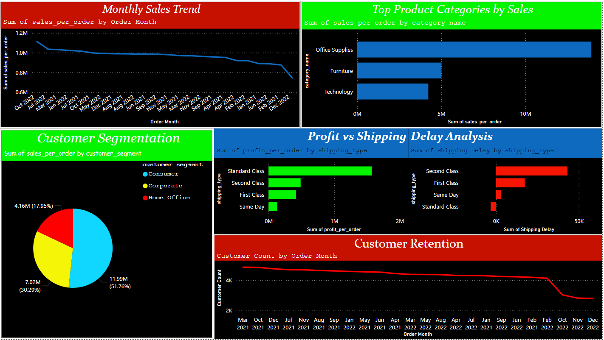
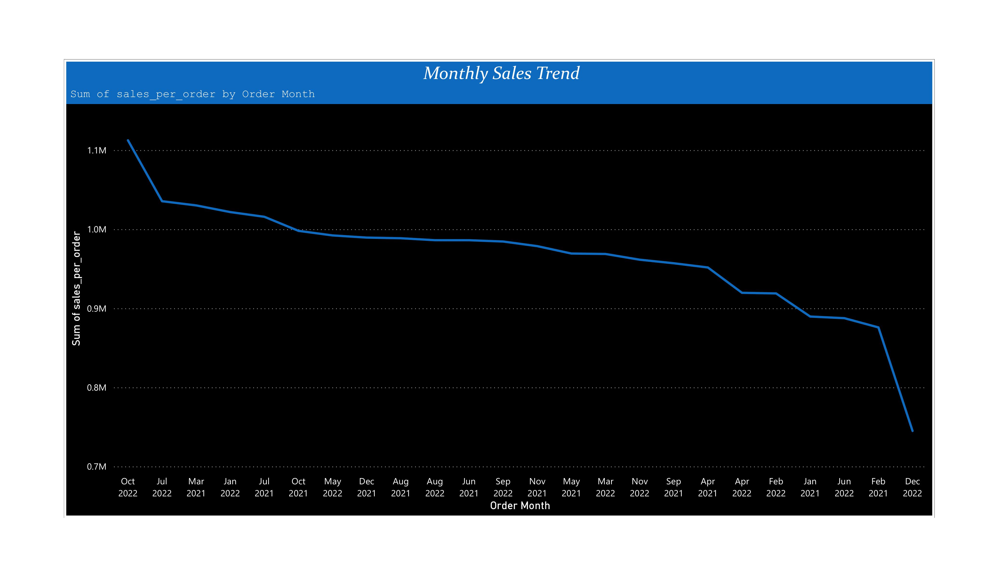
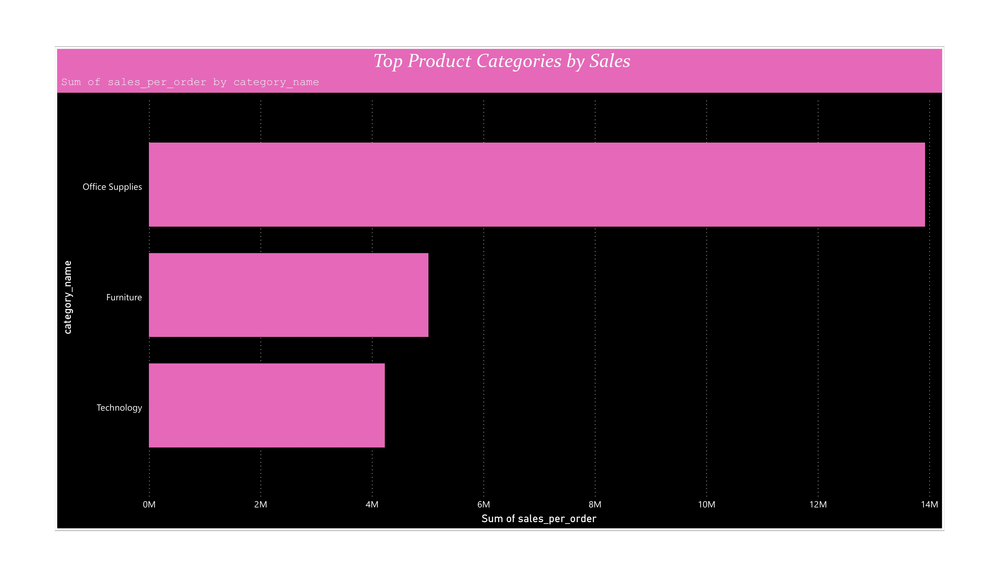
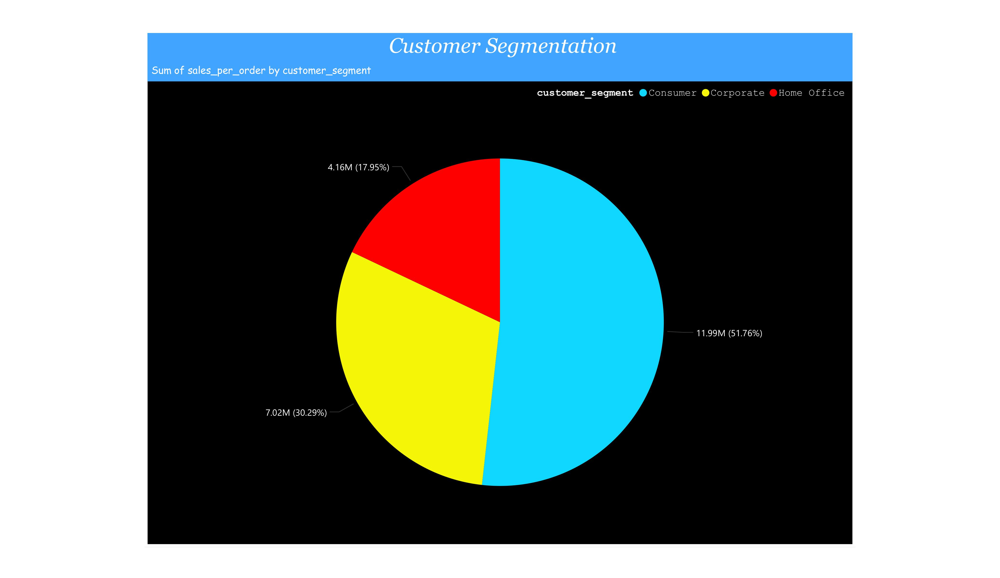
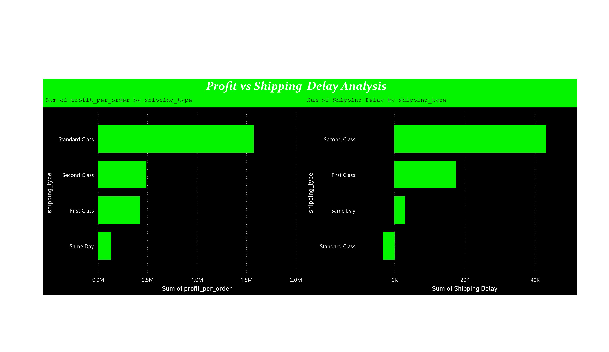
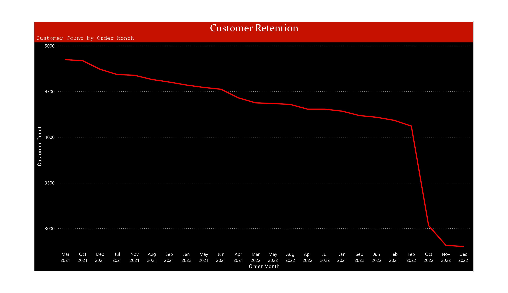

# E-Commerce Dashboard Project

This project analyzes key trends in an e-commerce dataset, covering **monthly sales trends**, **top product categories**, **customer segmentation**, **shipping analysis**, and **customer retention**. The dashboard provides actionable insights for improving business performance.

---

## 📈 **Full Dashboard Overview**

The final dashboard provides a consolidated view of all key metrics, offering a clear understanding of business performance.

---

## 📊 **Data Insights and Narrative**

### 1. **Monthly Sales Trends: Capitalizing on Sales Peaks**
The **Monthly Sales Trend Line Chart** revealed steady sales growth, with a significant spike in **Oct 2022**. Total sales reached **$450,000**, driven by demand for **Office Supplies**.

---

### 2. **Top Product Categories: Driving Sales with High-Performing Products**
The **Top Product Categories Bar Chart** shows that **Office Supplies** contributed **45%** of total sales, led by products like **Xerox 1913 Printers** and **Belkin Surge Protectors**. **Furniture** lagged behind, contributing only **12%**.

---

### 3. **Customer Segmentation: Understanding Who Our Buyers Are**
The **Customer Segmentation Pie Chart** shows that **Consumers customers** dominate sales, accounting for **60%** of the revenue, followed by **Corporate** with **30%**. Corporate clients prefer **Office Supplies**, while Consumers lean towards **Electronics**.

---

### 4. **Shipping and Order Insights: Improving Shipping Efficiency**
**Standerd Class shipping** is the most profitable option, though it experiences long delays (average of **4 days**). **Standard Class** shipping has the longest delays (average of **4 days**) and is more profitable.

---

### 5. **Customer Retention: Building Long-Term Loyalty**
The **Customer Retention Line Chart** indicates that **40%** of customers placed repeat orders, with retention highest in **Office Supplies**. Corporate clients contributed to the highest retention rates.

---

## 🚀 **Key Achievements and Actionable Insights**

1. **Maximized sales growth**: Identified peak periods for sales and top-performing product categories.
2. **Targeted marketing strategy**: Focus on Corporate customers and Office Supplies.
3. **Shipping optimization**: Balance speed and profitability by improving shipping methods.
4. **Customer loyalty**: Introduce loyalty programs to boost repeat purchases, particularly in Corporate segments.

---

## 📝 **Conclusion**

This e-commerce dashboard enables data-driven decision-making by offering insights into customer behavior, product performance, shipping efficiency, and retention strategies. These insights will help the business optimize operations and improve customer satisfaction, driving sustainable growth.

---
